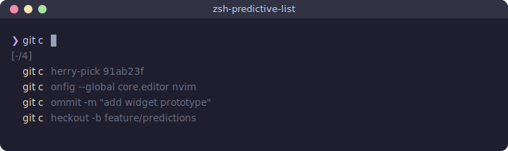

# zsh-predictive-list

PSReadLine-style **ListView** prediction for zsh. Predictions come **only from commands that exited 0** — typos and failures stay in raw history but never pollute your suggestions.

Inspired by [PSReadLine](https://github.com/PowerShell/PSReadLine)'s `ListView` prediction mode for PowerShell.

## What it does

<p align="center">
  
</p>

- **No ghost text** — clean list below the prompt, not mixed into your input
- **Header line** — shows `<-/N>` (no selection) or `<K/N>` (selected), with source count
- **Source tags** — each item shows `[History]` right-aligned
- **Success-only** — only commands that exited 0 feed predictions
- **Buffer updates on navigation** — ↓ selects an item and puts it in your buffer, ↑ restores your typed text

## Install

### zinit
```zsh
zinit light testycool/zsh-predictive-list
```

### oh-my-zsh
```zsh
git clone https://github.com/testycool/zsh-predictive-list ${ZSH_CUSTOM:-~/.oh-my-zsh/custom}/plugins/zsh-predictive-list
# Add to plugins=(...) in .zshrc
```

### Manual
```zsh
source /path/to/zsh-predictive-list.plugin.zsh
```

## Keybindings

| Key | Action |
|-----|--------|
| Type anything | List updates automatically |
| `Down` | Enter list / select next item (buffer updates to match) |
| `Up` | Select previous item / deselect (restores typed text) |
| `Right` | Accept top prediction (or selected) when cursor is at end of line |
| `Tab` | Accept current selection (only while navigating); otherwise normal completion |
| `Enter` | Execute current buffer |
| `Ctrl+G` | Dismiss list, restore typed text |
| `Alt+P` | Toggle predictions on/off |

Additional widgets (not bound by default — bind them yourself if needed):

| Widget | Action |
|--------|--------|
| `zpred-delete-entry` | Remove the selected entry from prediction history |

When no predictions match, `Up`/`Down`/`Right` fall back to their normal behavior.

## Configuration

Set these before sourcing the plugin:

```zsh
# History file location (default: ~/.local/share/zsh-predictive-list/success_history)
ZPRED_HISTORY="$HOME/.zsh_success_history"

# Max visible predictions (default: 6)
ZPRED_MAX_SHOW=8

# Max entries kept in memory and on disk (default: 5000)
ZPRED_MAX_HISTORY=5000

# Match mode: "prefix" (default) or "contains" (substring matching, prefix results shown first)
ZPRED_MATCH_MODE="contains"

# Styles (zsh region_highlight format)
ZPRED_STYLE_EMPHASIS="fg=yellow"      # matched prefix in unselected items
ZPRED_STYLE_SELECTED="standout"       # selected item (reverse video)
ZPRED_STYLE_DIM="fg=8"               # header, markers, source tags
```

## Importing existing history

New installs start with an empty prediction list. Import from your existing zsh history:

```zsh
zpred-import              # imports from $HISTFILE (handles both plain and EXTENDED_HISTORY format)
zpred-import /path/to/file  # import from a specific file
```

Since exit codes aren't stored in `$HISTFILE`, all entries are imported. The prediction list will self-correct over time as successful commands get recorded.

## How it works

1. `preexec` captures each command before execution
2. `precmd` checks `$?` — if 0, the command is appended to the success history file
3. `zle-line-pre-redraw` detects buffer changes and updates the prediction list
4. Matching runs against the deduplicated, most-recent-first success history (prefix or substring)
5. List renders via `POSTDISPLAY` + `region_highlight` (no ghost text)
6. Navigation with ↓ updates BUFFER to the selected command; ↑ at top restores typed text
7. Ctrl+G dismisses the list; typing again un-dismisses it
8. History file auto-truncates when it exceeds 2× `ZPRED_MAX_HISTORY`

## How it differs from other plugins

| | zsh-predictive-list | zsh-autosuggestions | zsh-autocomplete |
|---|---|---|---|
| Display | List below prompt | Inline ghost text | Completion menu |
| Source | Success history only | Full history + completion | Completion system |
| Navigation | ↑/↓ through list | → to accept | Tab cycling |
| Buffer | Updates on selection | Unchanged until accept | Unchanged until accept |

## Requirements

- zsh >= 5.4 (for `zle-line-pre-redraw`)

## Compatibility

- Chains with existing `zle-line-init`, `zle-line-pre-redraw`, and `zle-line-finish` hooks
- **Conflicts with zsh-autosuggestions** — both use `POSTDISPLAY`. Use one or the other.

## License

MIT
